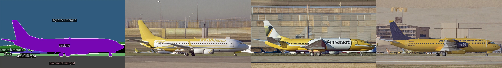

# OmniBooth

> OmniBooth: Learning Latent Control for Image Synthesis with Multi-modal Instruction <br>
> [Leheng Li](https://len-li.github.io), Weichao Qiu, Xu Yan, Jing He, Kaiqiang Zhou, Yingjie CAI, Qing LIAN, Bingbing Liu, Ying-Cong Chen

OmniBooth is a project focused on synthesizing image data following multi-modal instruction. Users can use text or image to control instance generation. This repository provides tools and scripts to process, train, and generate synthetic image data using COCO dataset, or self-designed data.

#### [Project Page](https://len-li.github.io/omnibooth-web) | [Paper](https://arxiv.org/abs/2410.04932) | [Video](https://len-li.github.io/omnibooth-web/videos/teaser-user-draw.mp4) | [Checkpoint](https://huggingface.co/lilelife/Omnibooth)


## Table of Contents

  - [Installation](#installation)
  - [Prepare Dataset](#prepare-dataset)
  - [Prepare Checkpoint](#prepare-checkpoint)
  - [Train](#train)
  - [Inference](#inference)
  - [Behavior analysis](#behavior-analysis)
  - [Data sturture](#instance-data-structure)
  


## Installation

To get started with OmniBooth, follow these steps:

1. **Clone the repository:**
   ```bash
   git clone https://github.com/Len-Li/OmniBooth.git
   cd OmniBooth
   ```

2. **Set up a environment :**
   ```bash
   pip install torch torchvision transformers
   pip install diffusers==0.26.0.dev0 
   # We use a old version of diffusers, please take care of it.

   pip install albumentations pycocotools 
   pip install git+https://github.com/cocodataset/panopticapi.git
   ```


## Prepare Dataset

You can skip this step if you just want to run a demo generation. I've prepared demo mask in `data/instance_dataset` for generation. Please see [Inference](#inference).

To train OmniBooth, follow the steps below:

1. **Download the [COCONut](https://github.com/bytedance/coconut_cvpr2024/blob/main/preparing_datasets.md) dataset:**
    
    We use COCONut-S split.
    Please download the COCONut-S file and relabeled-COCO-val from [here](https://github.com/bytedance/coconut_cvpr2024?tab=readme-ov-file#dataset-splits) and put it in `data/coconut_dataset` folder. I recommend to use [Kaggle](https://www.kaggle.com/datasets/xueqingdeng/coconut) link.


2. **Download the COCO dataset:**
    ```
    cd data/coconut_dataset 
    mkdir coco && cd coco

    wget http://images.cocodataset.org/zips/train2017.zip
    wget http://images.cocodataset.org/zips/val2017.zip
    wget http://images.cocodataset.org/annotations/annotations_trainval2017.zip

    unzip train2017.zip && unzip val2017.zip
    unzip annotations_trainval2017.zip
    ```


    Then, please download the instance prompt from [hf](https://huggingface.co/lilelife/OmniBooth/tree/main/data).

    After preparation, you will be able to see the following directory structure:  

    ```
    OmniBooth/
    ├── data/
    │   ├── instance_dataset/
    │   ├── coconut_dataset/
    │   │   ├── coco/
    │   │   ├── coconut_s/
    |   |   ├── relabeled_coco_val/
    │   │   ├── annotations/
    │   │   │   ├── coconut_s.json
    │   │   │   ├── relabeled_coco_val.json
    │   │   │   ├── my-train.json
    │   │   │   ├── my-val.json
    ```


## Prepare Checkpoint
Our model is based on [stable-diffusion-xl-base-1.0](https://huggingface.co/stabilityai/stable-diffusion-xl-base-1.0). We additionaly use [sdxl-vae-fp16-fix](https://huggingface.co/madebyollin/sdxl-vae-fp16-fix) to avoid numerical issue in VAE decoding. Please download the two models and put them at `./OmniBooth/ckp/`.

Download `dinov2_vitl14_reg4_pretrain.pth` for image feature extraction. [Link.](https://dl.fbaipublicfiles.com/dinov2/dinov2_vitl14/dinov2_vitl14_reg4_pretrain.pth) Also put it at `./OmniBooth/ckp/`.

Our checkpoint of OmniBooth is released in [huggingface](https://huggingface.co/lilelife/OmniBooth). If you want to use our model to run inference. Please put them at `./OmniBooth/ckp/`.

## Train 

   ```bash
   bash train.sh
   ```
The details of the script are as follows:
```bash
export MODEL_DIR="./ckp/stable-diffusion-xl-base-1.0"
export VAE_DIR="./ckp/sdxl-vae-fp16-fix"

export EXP_NAME="omnibooth_train"
export OUTPUT_DIR="./ckp/$EXP_NAME"

accelerate launch --gpu_ids 0,  --num_processes 1  --main_process_port 3226  train.py \
      --pretrained_model_name_or_path=$MODEL_DIR \
      --pretrained_vae_model_name_or_path=$VAE_DIR \
      --output_dir=$OUTPUT_DIR \
      --width=1024 \
      --height=1024 \
      --patch_size=364 \
      --learning_rate=4e-5 \
      --num_train_epochs=12 \
      --train_batch_size=1 \
      --mulscale_batch_size=2 \
      --mixed_precision="fp16" \
      --num_validation_images=2 \
      --validation_steps=500 \
      --checkpointing_steps=5000 \
      --checkpoints_total_limit=10 \
      --ctrl_channel=1024 \
      --use_sdxl=True \
      --enable_xformers_memory_efficient_attention \
      --report_to='wandb' \
      --resume_from_checkpoint="latest" \
      --tracker_project_name="omnibooth-demo" 
```

The training process will take 3 days to complete using 8 NVIDIA A100. We use batchsize=2, image height set as 1024, image width follows the ground-truth image ratio. It will take 65GB memory for each GPU.

## Inference 

```bash
bash infer.sh
```
You will find generated images at `./vis_dir/`. The image is shown as follows:



## Behavior analysis

1. The text instruction is not perfect, it is applicable to descriptions of attributes like color, but it is difficult to provide more granular descriptions. Scaling the data and model can help with this problem.
2. The image instruction may result in generated images with washed-out colors, possibly due to brightness augmentation. This can be adjusted by editing global prompt: ‘a brighter image’.
3. Video Dataset. Ideally, we should use video datasets to train image-instructed generation, similar to Anydoor. However, in our multi-modal setting, the cost of obtaining video datasets + tracking annotations + panoptic annotations is relatively high, so we only trained our model on the single-view COCO dataset. If you plan to expand the training data to video datasets, please let me know.


## Instance data structure

I provide several instance mask datasets for inference in `data/instance_dataset`. This data is converted from coco dataset. The data structure is as follows:

```
# use data/instance_dataset/plane as an example
0000_mask.png
0000.png
0001_mask.png
0001.png
0002_mask.png
0002.png
...
prompt_dict.json
```
The mask file is a binary mask that indicate the instance location. The image file is the optional image reference. Turn the `--text_or_img=img` to use it.

 The `prompt_dict.json` is a dictionary contains instance prompt and global_prompt. The prompt is a string that describes the instance or global image. For example, `"prompt_dict.json"` is as follows:

```json
{
   "prompt_0": "a plane is silhouetted against a cloudy sky", 
   "prompt_1": "a road", 
   "prompt_2": "a pavement of merged", 
   "global_prompt": "large mustard yellow commercial airplane parked in the airport"
}
```


## Acknowledgment
Additionally, we express our gratitude to the authors of the following opensource projects:

- [Diffusers controlnet example](https://github.com/huggingface/diffusers/tree/main/examples/controlnet) (ControlNet training script)
- [COCONut](https://github.com/bytedance/coconut_cvpr2024) (Panoptic mask annotation)
- [SyntheOcc](https://len-li.github.io/syntheocc-web/) (Network structure)


## BibTeX

```bibtex
@inproceedings{li2024OmniBooth,
              title={OmniBooth: Synthesize Geometric Controlled Street View Images through 3D Semantic MPIs},
              author={Li, Leheng and Qiu, Weichao and Chen, Ying-Cong et.al.},
              booktitle={arxiv preprint},
              year={2024}
            }
```

This project is licensed under the MIT License - see the [LICENSE](LICENSE) file for details.


